# Dự án Quản lý Thiết bị Phòng học (Java Thymeleaf)

Đây là một ứng dụng web được xây dựng bằng **Java Spring Boot** và **Thymeleaf**, giúp quản lý hiệu quả các thiết bị trong các phòng học, phòng thí nghiệm và phòng đào tạo. Ứng dụng cung cấp giao diện người dùng hiện đại, dễ sử dụng cùng với một backend mạnh mẽ, bảo mật và có khả năng mở rộng.

## 🖼️ Hình ảnh minh họa

- **Chứng chỉ TLS tự ký**  
  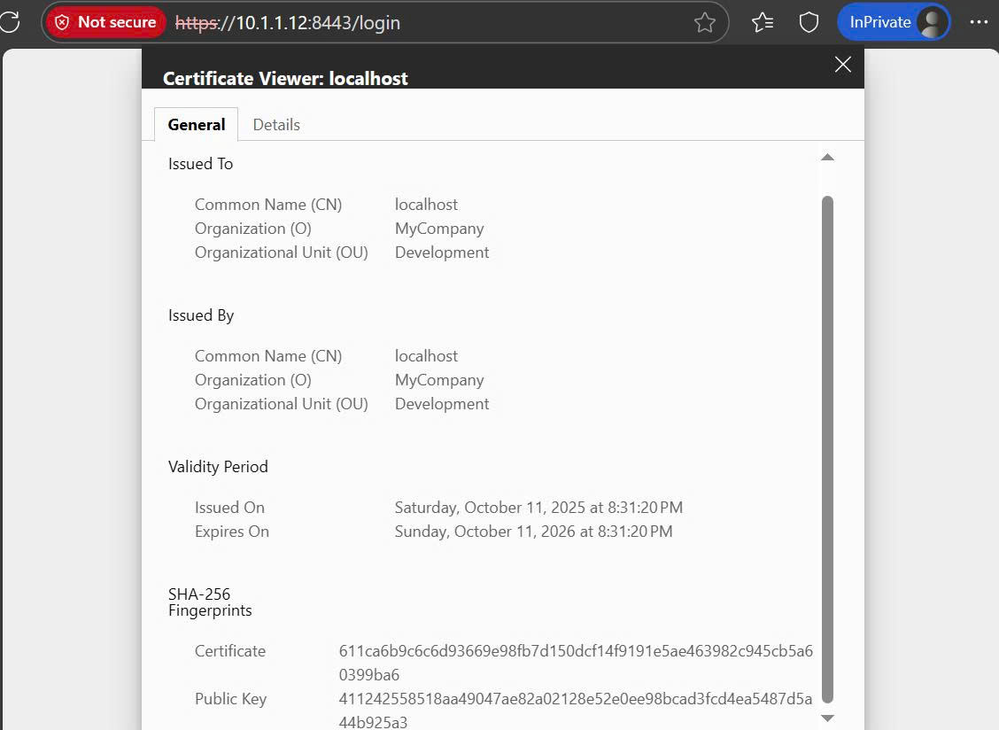  
- **Màn hình đăng nhập trước khi thao tác với hệ thống (bắt buộc)**  
  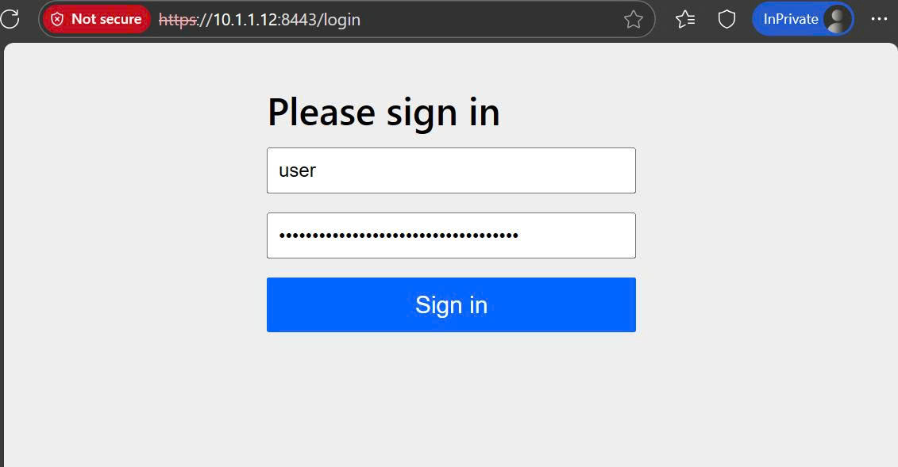  
- **Trang chủ, hiển thị tất cả thiết bị**  
  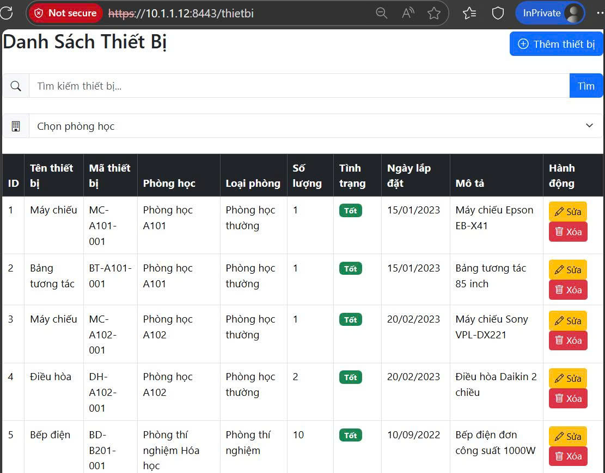  
- **Request không hợp lệ được redirect về /thietbi**  
  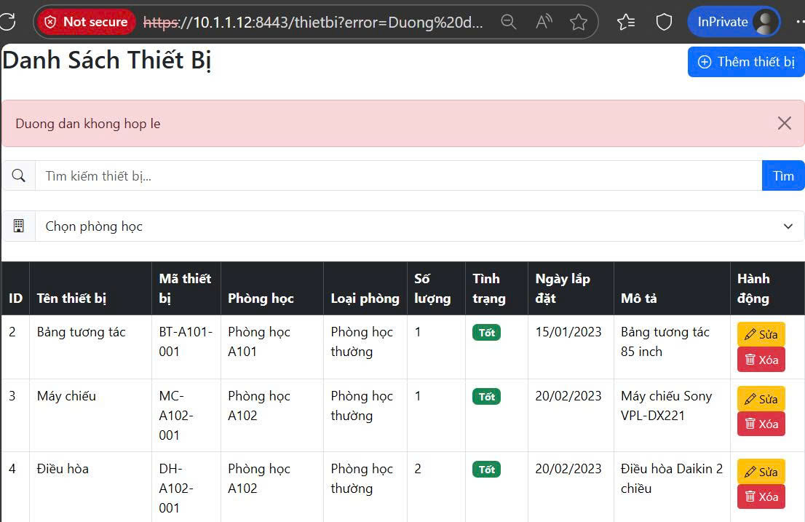  
- **Thêm thiết bị mới**  
  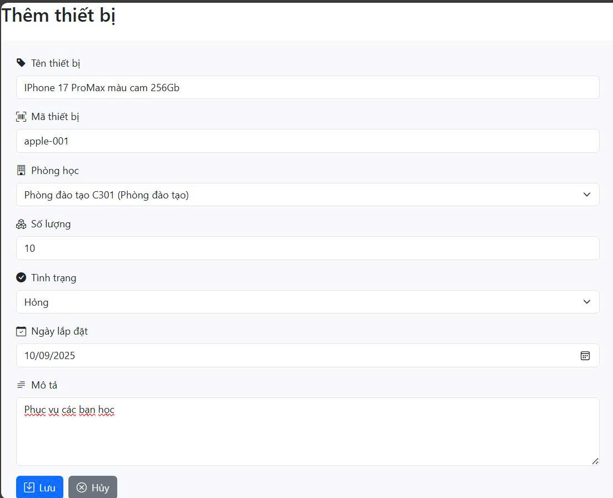  
- **Kết quả sau khi thêm thiết bị**  
  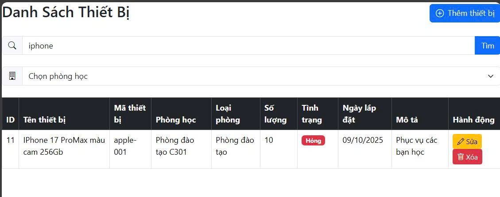  
- **Chỉnh sửa thông tin về thiết bị**  
  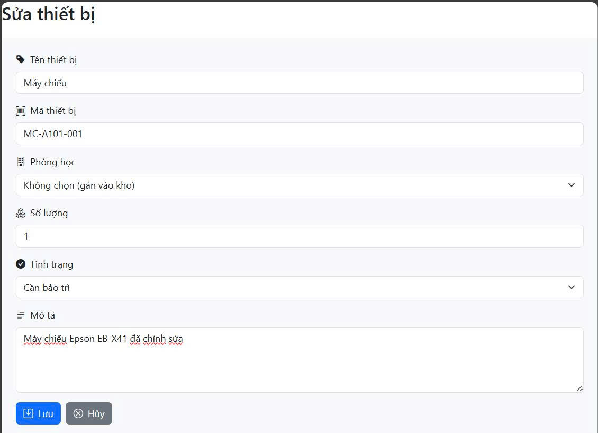  
- **Kết quả sau khi chỉnh sửa**  
  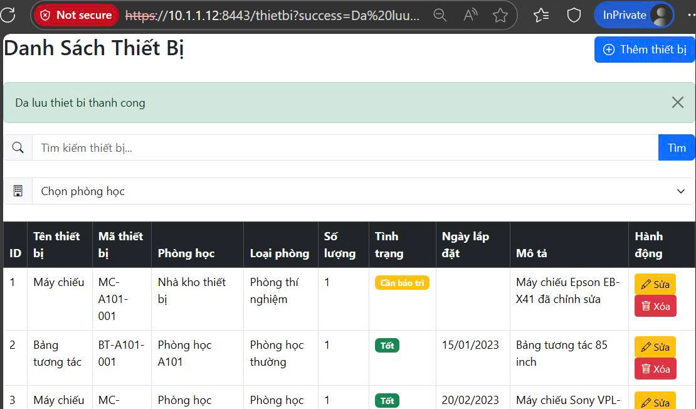  
- **Tìm kiếm thiết bị theo tên**  
  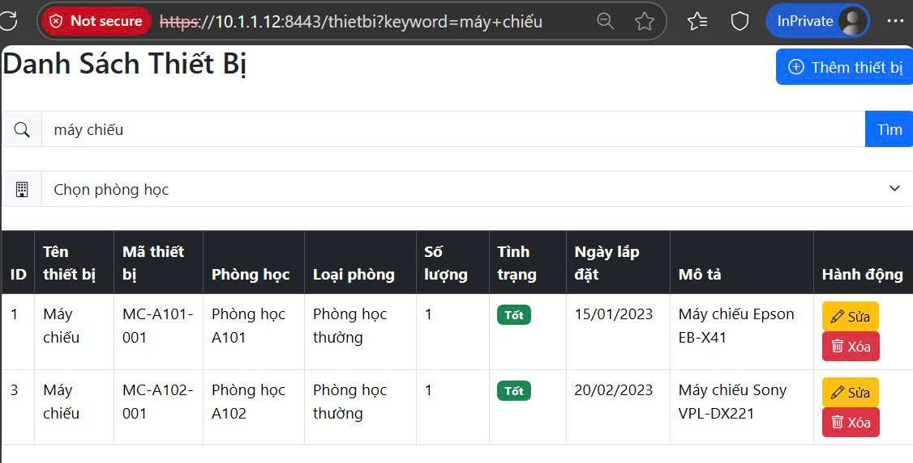  
- **Liệt kê các thiết bị trong phòng học**  
  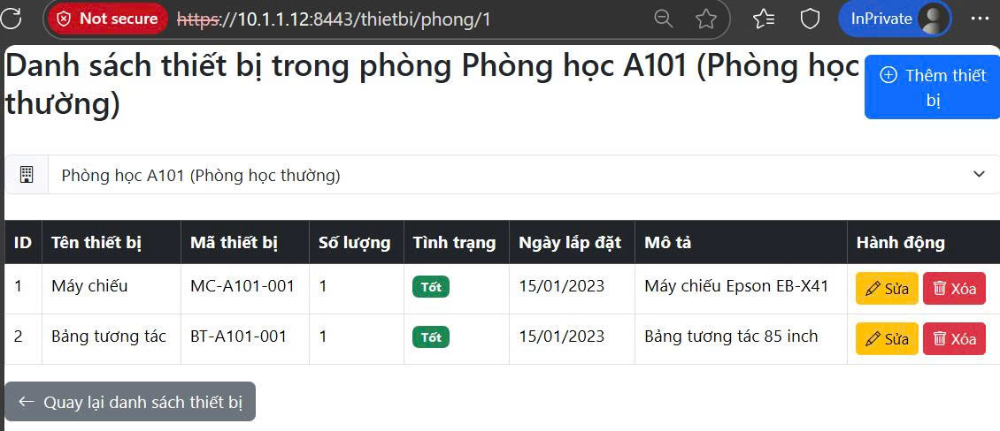  
- **Xóa thiết bị**  
  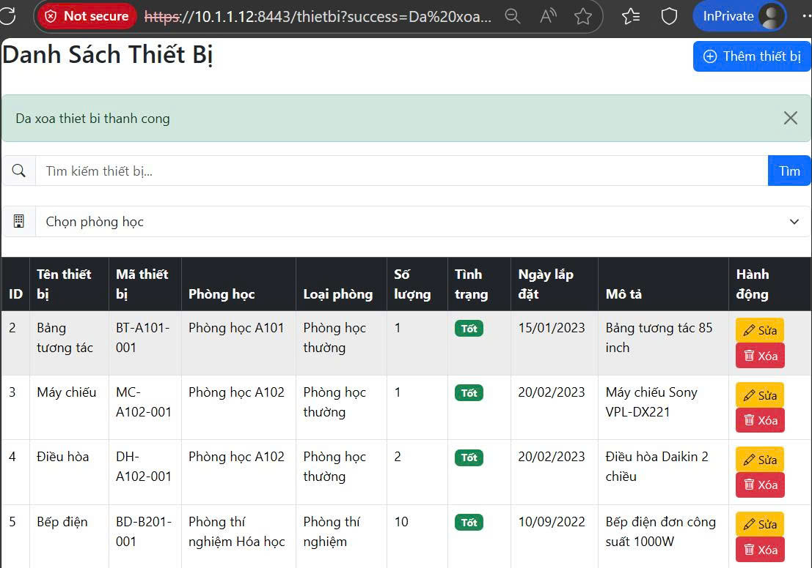  

## ✨ Tính năng nổi bật

- **Quản lý Thiết bị Toàn diện**: Thêm, sửa, xóa và xem chi tiết danh sách thiết bị.
- **Tìm kiếm & Lọc Linh hoạt**: Dễ dàng tìm kiếm thiết bị theo tên và lọc danh sách thiết bị theo từng phòng học cụ thể.
- **Validation Dữ liệu Chặt chẽ**: Đảm bảo tính toàn vẹn dữ liệu với validation cả ở Frontend (HTML5) và Backend (Jakarta Validation).
- **Quản lý Kho & Phân bổ**: Cho phép gán thiết bị vào các phòng học cụ thể hoặc lưu trữ trong "Kho" trung tâm.
- **Giao diện Hiện đại & Responsive**: Giao diện người dùng được thiết kế bằng Bootstrap, thân thiện và tương thích với nhiều kích thước màn hình.
- **Bảo mật Tăng cường**:
  - Tích hợp các biện pháp chống lại các lỗ hổng phổ biến như SQL Injection và XSS.
  - Sử dụng CSRF token cho các yêu cầu POST để đảm bảo an toàn.
  - 🔐 Chạy trên giao thức **HTTPS** an toàn với chứng chỉ tự ký (self-signed certificate) cho môi trường phát triển.
- **Triển khai Dễ dàng với Docker**: Đóng gói toàn bộ ứng dụng (Spring Boot App + MySQL Database) vào Docker Compose, cho phép chạy dự án chỉ với một lệnh duy nhất.
- **Logging Chi tiết**: Sử dụng SLF4J để ghi lại các hoạt động quan trọng và lỗi phát sinh trong hệ thống.
- **Điều hướng Thông minh**: Tự động chuyển hướng tất cả các đường dẫn không hợp lệ về trang danh sách thiết bị chính.

## 🛠️ Công nghệ sử dụng

- **Backend**: Java 17+, Spring Boot, Spring Data JPA, Jakarta Validation, SLF4J
- **Frontend**: Thymeleaf, HTML5, CSS3, Bootstrap 5, JavaScript
- **Cơ sở dữ liệu**: MySQL
- **Build & Deployment**: Maven, Docker, Docker Compose

## 🚀 Cài đặt và Chạy dự án

### Yêu cầu

- **Java Development Kit (JDK) 17+** (cần cho keytool).
- **Docker** và **Docker Compose** đã được cài đặt trên máy.

### Hướng dẫn chạy bằng Docker Compose (Khuyến khích)

Đây là cách nhanh nhất để khởi chạy toàn bộ dự án với HTTPS đã được cấu hình sẵn.

1. **Clone repository về máy**:

   ```bash
   git clone https://github.com/TuDaoLW/quan_ly_thiet_bi
   cd quan_ly_thiet_bi
   ```

2. **(Tùy chọn)Tạo chứng chỉ HTTPS (Self-signed Certificate)**:  
   Chạy lệnh sau từ thư mục gốc của dự án để tạo file `keystore.p12` và đặt nó vào đúng vị trí mà Dockerfile sẽ sử dụng.

   ```bash
   keytool -genkeypair -alias qlytbi -keyalg RSA -keysize 2048 -storetype PKCS12 -keystore ./qlytbi/src/main/resources/keystore.p12 -validity 365 -dname "CN=localhost, OU=Dev, O=MyCompany, L=Hanoi, C=VN"
   ```

   Khi được hỏi, hãy nhập mật khẩu cho keystore (ví dụ: `elcom@123`).  
   **Lưu ý**: Mật khẩu này phải khớp với mật khẩu trong file `application.properties`.
   **CÓ THỂ BỎ QUA VÀ SỬ DỤNG KEYSTORE ĐƯỢC TẠO SẴN TRONG REPO NÀY**

3. **Khởi chạy ứng dụng với Docker Compose**:

   ```bash
   docker compose up --build -d
   ```

   Lệnh này sẽ tự động:
   - Build Docker image cho ứng dụng Spring Boot (đã bao gồm file keystore).
   - Khởi tạo container MySQL với dữ liệu mẫu.
   - Khởi động ứng dụng Spring Boot trên cổng **8443** với HTTPS.

4. **Truy cập ứng dụng**:  
   Lấy mật khẩu đăng nhập cho 'user'

   ```bash
   docker logs qlytbi-app | grep password
   ```

   Mở trình duyệt và truy cập vào địa chỉ:  
   [https://localhost:8443](https://localhost:8443)

### ⚠️ Cảnh báo Bảo mật

Vì bạn đang sử dụng chứng chỉ tự ký, trình duyệt sẽ hiển thị cảnh báo **"Your connection is not private"**. Đây là điều bình thường. Hãy nhấn **"Advanced"** -> **"Proceed to localhost (unsafe)"** để tiếp tục.

### Hướng dẫn chạy thủ công (Development)

1. **Cài đặt và chạy MySQL Server**:
   - Đảm bảo MySQL server đang hoạt động.
   - Chạy script trong file `db/init.sql` để tạo database, bảng và dữ liệu mẫu.

2. **Cấu hình ứng dụng**:
   - Mở file `qlytbi/src/main/resources/application.properties`.
   - Bỏ comment và cập nhật các thông tin `spring.datasource.url`, `spring.datasource.username`, `spring.datasource.password` cho phù hợp với cấu hình MySQL của bạn.

3. **Tạo và cấu hình chứng chỉ HTTPS**:
   - **Tạo Keystore**: Chạy lệnh `keytool` như trong hướng dẫn Docker ở trên để tạo file `keystore.p12` và đặt nó trong `qlytbi/src/main/resources/`.
   - **Kiểm tra cấu hình**: Đảm bảo các dòng sau tồn tại trong `application.properties`:

     ```properties
     # Cấu hình HTTPS
     server.port=8443
     server.ssl.enabled=true
     server.ssl.key-store-type=PKCS12
     server.ssl.key-store=classpath:keystore.p12
     server.ssl.key-store-password=elcom@123
     server.ssl.key-alias=qlytbi
     ```
    **CÓ THỂ BỎ QUA VÀ SỬ DỤNG KEYSTORE ĐƯỢC TẠO SẴN TRONG REPO NÀY**
4. **Build và chạy ứng dụng**:  
   Mở terminal tại thư mục `qlytbi` và chạy lệnh Maven:

   ```bash
   mvn spring-boot:run > output.log 2>&1 
   ```
   Xem log và lấy mật khẩu đăng nhập cho 'user'

5. **Truy cập ứng dụng**:  
   Mở trình duyệt và truy cập: [https://localhost:8443](https://localhost:8443).  
   Chấp nhận cảnh báo bảo mật như đã giải thích ở trên.

## 📖 Chức năng Chi tiết

### 1. Quản lý Thiết bị

| **Chức năng**           | **Method** | **Đường dẫn**                     | **Mô tả**                                                                 |
|-------------------------|------------|-----------------------------------|---------------------------------------------------------------------------|
| Hiển thị danh sách      | GET        | `/thietbi`                       | Hiển thị toàn bộ thiết bị, hỗ trợ tìm kiếm theo keyword.                  |
| Form thêm mới           | GET        | `/thietbi/add`                   | Hiển thị form để nhập thông tin thiết bị mới.                             |
| Lưu thiết bị            | POST       | `/thietbi/save`                  | Lưu thông tin thiết bị mới hoặc cập nhật thiết bị đã có.                  |
| Form chỉnh sửa          | GET        | `/thietbi/edit/{id}`             | Lấy thông tin thiết bị theo id và hiển thị trên form.                     |
| Xóa thiết bị            | POST       | `/thietbi/delete/{id}`           | Xóa thiết bị khỏi hệ thống (có xác nhận từ người dùng).                   |
| Xem theo phòng          | GET        | `/thietbi/phong/{idPhong}`       | Hiển thị danh sách thiết bị của một phòng học cụ thể.                     |

### 2. Validation và Ràng buộc

- **Tên thiết bị**:  
  - Bắt buộc, từ 3 đến 100 ký tự.
- **Mã thiết bị**:  
  - Bắt buộc, duy nhất, chỉ chứa chữ cái, số, và dấu gạch ngang (`[A-Za-z0-9-]+`).
- **Số lượng**:  
  - Bắt buộc, phải là số nguyên lớn hơn 0.
- **Tình trạng**:  
  - Bắt buộc, phải là một trong các giá trị: "Tốt", "Cần bảo trì", "Hỏng".
- **Ngày lắp đặt**:  
  - Bắt buộc khi thiết bị được gán cho một phòng học (khác Kho).  
  - Không được là một ngày trong tương lai.  
  - Để trống (`NULL`) nếu thiết bị nằm trong kho (K00).

### 3. Quản lý Phòng học

- Dữ liệu phòng học được tải và hiển thị trong các menu dropdown để người dùng dễ dàng lựa chọn.
- Hệ thống định nghĩa một phòng đặc biệt là **"Kho"** (mã `K00`) để chứa các thiết bị chưa được lắp đặt.
